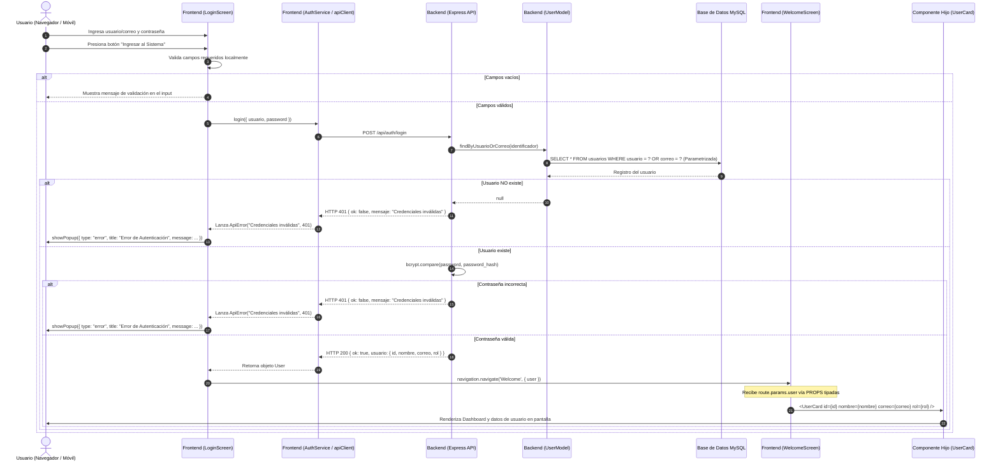

# Arquitectura del Sistema y Flujo de Datos

Este documento describe la arquitectura técnica del proyecto, el flujo completo de autenticación de extremo a extremo, el patrón **Atomic Design** utilizado en la capa de interfaz y el mecanismo estricto de **paso de propiedades (Props)** hacia la pantalla de bienvenida y sus componentes hijos.

---

## 1. Diagrama de Flujo de Autenticación (Mermaid)



---

## 2. Metodología Atomic Design

La interfaz de usuario está dividida estrictamente bajo el paradigma de **Atomic Design**, garantizando componentes altamente reutilizables, independientes y con una única responsabilidad.

```
/frontend/scripts/components
  ├── /atoms        (Unidades mínimas indivisibles)
  │     ├── Button.tsx     -> Botón con variantes visuales, estados y accesibilidad
  │     ├── Input.tsx      -> Campo de entrada estilizado con bordes dinámicos
  │     ├── Label.tsx      -> Tipografía centralizada del sistema
  │     ├── Icon.tsx       -> Iconos vectoriales Ionicons
  │     └── Spinner.tsx    -> Indicador de carga accesible
  ├── /molecules    (Combinaciones de átomos con propósito funcional)
  │     ├── FormField.tsx      -> Label + Input + mensaje de validación
  │     ├── PasswordField.tsx  -> Label + Input + toggle de visibilidad (ojo)
  │     ├── ThemeToggle.tsx    -> Switch de tema claro/oscuro
  │     └── InfoRow.tsx        -> Icono + Etiqueta + Valor de dato
  ├── /organisms    (Bloques complejos de UI compuestos por moléculas y átomos)
  │     ├── Header.tsx         -> Barra superior de navegación y controles de tema
  │     ├── LoginForm.tsx      -> Formulario de inicio de sesión con estado interno
  │     └── UserCard.tsx       -> Ficha de usuario receptora de PROPS
  ├── /grid         (Estructura y disposición visual)
  │     ├── Container.tsx      -> Contenedor adaptativo tipo Bootstrap o fluido
  │     ├── Row.tsx            -> Fila flexible con márgenes negativos (gutters)
  │     └── Col.tsx            -> Columna de 12 divisiones según breakpoints
  └── /feedback     (Canales globales de retroalimentación)
        └── PopupModal.tsx     -> Modal animado que reemplaza alert()
```

---

## 3. Flujo y Paso de Propiedades (PROPS)

Para garantizar un código limpio, desacoplado y con TypeScript estricto, la transmisión de información sigue las siguientes reglas:

1. **Parámetros de Navegación:**
   Al autenticarse con éxito, `LoginScreen` transfiere el objeto de usuario mediante React Navigation:
   ```typescript
   navigation.navigate('Welcome', { user });
   ```
2. **Recepción en Pantalla:**
   `WelcomeScreen` recibe las propiedades tipadas mediante `WelcomeScreenProps`:
   ```typescript
   export const WelcomeScreen: React.FC<WelcomeScreenProps> = ({ route, navigation }) => {
     const { user } = route.params;
     // ...
   }
   ```
3. **Distribución a Componentes Hijos:**
   La pantalla **no renderiza datos crudos inline**, sino que los transfiere de forma declarativa como **props** a `UserCard`:
   ```tsx
   <UserCard
     id={user.id}
     nombre={user.nombre}
     correo={user.correo}
     rol={user.rol}
     onLogout={handleLogout}
   />
   ```
4. **Desglose en Moléculas:**
   A su vez, `UserCard` recibe las props y las pasa a moléculas `InfoRow`:
   ```tsx
   <InfoRow iconName="mail-outline" label="Correo Electrónico" value={correo} />
   <InfoRow iconName="ribbon-outline" label="Rol y Nivel de Acceso" value={rol} />
   ```
